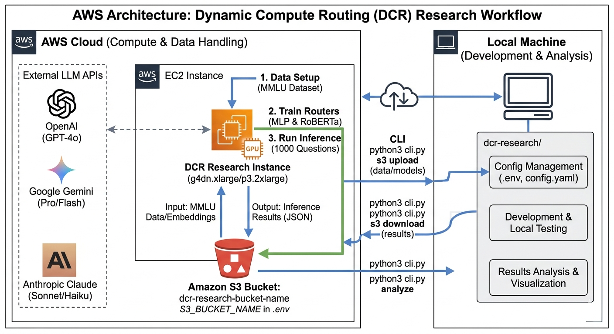

# Dynamic Compute Routing (DCR) Research

**Optimizing LLM Output Token Usage Through Intelligent Template Selection**

## Paper

This research has been published as a pre-print on arXiv:

**[Dynamic Compute Routing: Optimizing LLM Output Token Usage Through Intelligent Template Selection](https://arxiv.org/abs/2511.20683)**

If you use this code or find our research useful, please cite:

```bibtex
@article{yadavalli2025dcr,
  title={Dynamic Compute Routing: Optimizing LLM Output Token Usage Through Intelligent Template Selection},
  author={Yadavalli, Bharadwaj},
  journal={arXiv preprint arXiv:2511.20683},
  year={2025}
}
```

---

## Architecture



The research pipeline supports both local development and AWS-based training/inference. Key components:

- **AWS EC2 Instance** - GPU-enabled instance (g4dn.xlarge/p3.2xlarge) for data setup, router training, and large-scale inference
- **External LLM APIs** - OpenAI GPT-4o, Google Gemini Pro/Flash, and Anthropic Claude Sonnet/Haiku for response generation
- **Amazon S3** - Central storage for MMLU data, trained models, and inference results
- **Local Machine** - Development, configuration management, and results analysis/visualization

---

## Overview

This research evaluates routing strategies for reducing LLM output tokens by intelligently selecting prompt templates based on question complexity. We compare three approaches across OpenAI, Google Gemini, and Anthropic Claude.

### Routing Strategies

1. **Baseline** - Always uses verbose template (ground truth comparison)
2. **Simple Neural** - MLP classifier with OpenAI embeddings
3. **RoBERTa** - Fine-tuned transformer classifier

### Templates

| Template | Output Tokens | Use Case |
|----------|--------------|----------|
| Minimal | 50 | Simple factual answers |
| Standard | 200 | General questions |
| Verbose | 500 | Complex explanations |
| Technical | 400 | Scientific/technical |
| Educational | 350 | Teaching explanations |

---

## Quick Start

### Prerequisites

```bash
# Install dependencies
pip install -r requirements.txt

# Configure API keys and S3 bucket
cp .env.template .env
# Edit .env and add:
#   OPENAI_API_KEY=sk-...
#   GOOGLE_API_KEY=AIza...
#   ANTHROPIC_API_KEY=sk-ant-...
#   S3_BUCKET_NAME=your-bucket-name  # Optional, for AWS sync
```

### Configuration

Edit `config.yaml` to choose testing (cheap) or production (expensive) models:

```yaml
mode: "testing"  # or "production"

# Testing: gpt-4o-mini, gemini-2.0-flash-lite, claude-3-5-haiku
# Production: gpt-4o, gemini-2.5-pro, claude-sonnet-4-5
```

---

## Complete Workflow

### 1. Setup Data (~10 minutes)

```bash
python3 cli.py data setup
```

Downloads MMLU dataset (5,000 questions) and generates OpenAI embeddings.

**Output:** `data/mmlu_train.json`, `data/mmlu_test.json`, embeddings

### 2. Train Routers (~3 hours with GPU)

```bash
# Train MLP router (~5 minutes on CPU)
python3 cli.py train mlp

# Train RoBERTa router (~2-3 hours on GPU)
python3 cli.py train transformer
```

**Output:** `models/simple_neural_router.pkl`, `models/transformer_roberta-base/`

### 3. Run Inference

**IMPORTANT:** Always test with 10 questions first to verify the fix!

```bash
# STEP 1: Test with 10 questions to verify (90 API calls, ~$0.02)
python3 cli.py infer --num-questions 10

# STEP 2: Verify the fix worked
python3 test_fix.py

# If test passes (>85% extraction rate):
# STEP 3: Scale to 100 questions (900 calls, ~$0.21)
python3 cli.py infer --num-questions 100

# STEP 4: Full research run: 1000 questions (9,000 calls, ~$2.08)
python3 cli.py infer --num-questions 1000
```

Each question is tested with all 3 routing strategies across all 3 providers.

**Output:** `dcr_results/dcr_n{N}_results.json`

### 4. Analyze Results

```bash
python3 cli.py analyze
```

**Output:**
- `dcr_analysis/validation_report.json` - **Data quality checks** (low tokens, failures, anomalies)
- `dcr_analysis/suspicious_responses.json` - **Detailed samples** of flagged responses for manual review
- `dcr_analysis/success_rates.csv` - Accuracy by provider & strategy
- `dcr_analysis/template_distribution.csv` - Template usage patterns
- `dcr_analysis/token_savings.json` - Actual token usage and savings
- `dcr_analysis/summary_report.txt` - Human-readable summary with validation warnings

**Automatic Validation (Runs Every Time):**
- ✅ Detects suspiciously low token responses (< 20 tokens = likely errors)
- ✅ Checks for error keywords (cannot, error, sorry, refuse)
- ✅ Shows sample responses in console output
- ✅ Saves detailed suspicious responses for manual review
- ✅ Flags failed API calls
- ✅ Shows token distribution statistics
- ✅ Warns about potential quality issues

---

## AWS → Local Workflow

Train on AWS with GPU, analyze on local machine:

### On AWS (Training & Inference):

```bash
# 1. Setup and train
python3 cli.py data setup
python3 cli.py train mlp
python3 cli.py train transformer

# 2. Upload models to S3
python3 cli.py s3 upload models

# 3. Run inference (auto-uploads results to S3)
python3 cli.py infer --num-questions 1000
```

### On Local Machine (Analysis):

```bash
# 1. Download inference results
python3 cli.py s3 download results

# 2. Download models (optional, if you want to inspect)
python3 cli.py s3 download models

# 3. Analyze locally
python3 cli.py analyze

# 4. Upload analysis to S3 (optional)
python3 cli.py s3 upload analysis
```

**Key Points:**
- Inference automatically uploads results to S3 ✅
- Models must be uploaded manually with `python3 cli.py s3 upload models`
- Set `S3_BUCKET_NAME` in `.env` on both AWS and local machines

---

## Repository Structure

**Organized by functionality (17 Python files, 3,838 lines total)**

```
dcr-research/
│
├── 📄 Config Files
│   ├── .env               # API keys (gitignored)
│   ├── config.yaml        # Model configuration
│   └── requirements.txt   # Dependencies
│
├── ⭐ Main Entry Point
│   └── cli.py             # Unified CLI interface
│
├── 📦 core/               # Core utilities and providers
│   ├── __init__.py
│   ├── utils.py           # Config loading, data utilities
│   ├── providers.py       # OpenAI/Gemini/Claude APIs
│   └── question_manager.py # Question caching
│
├── 📦 data_prep/          # Data preparation
│   ├── __init__.py
│   ├── data_setup.py      # MMLU data + embeddings
│   └── s3.py              # AWS S3 utilities
│
├── 📦 training/           # Model training
│   ├── __init__.py
│   ├── train.py           # Train MLP router (includes MLPRouter class)
│   ├── train_transformer.py # Train RoBERTa router (includes TransformerTemplateClassifier)
│   ├── experiments_models.py # ML ablation study
│   └── experiments_transformers.py # Transformer ablation study
│
├── 📦 inference/          # Inference pipeline
│   ├── __init__.py
│   ├── inference.py       # Main DCR pipeline
│   └── merge_results.py   # Merge provider results
│
├── 📦 analysis/           # Analysis and visualization
│   ├── __init__.py
│   ├── analyze.py         # Results analysis
│   ├── validate_responses.py # Response validation
│   ├── generate_additional_figures.py # Generate visualizations
│   └── generate_cost_quality_plot.py  # Cost-quality plots
│
├── 📦 tests/              # Testing
│   ├── __init__.py
│   └── test_fix.py        # Verify MMLU formatting fix
│
├── 📂 Generated Data (gitignored)
│   ├── data/              # MMLU dataset + embeddings
│   ├── models/            # Trained routers
│   ├── dcr_results/       # Inference outputs
│   └── dcr_analysis/      # Analysis results
│
└── 📂 Paper
    └── paper/             # LaTeX files, figures, tables
```

---

## CLI Reference

### Data Operations

```bash
python3 cli.py data setup    # Download MMLU + generate embeddings
```

### Training

```bash
python3 cli.py train mlp          # Train MLP router (~5 min)
python3 cli.py train transformer  # Train RoBERTa router (~2-3 hours GPU)
```

### Inference

```bash
# Basic usage
python3 cli.py infer --num-questions 100

# Test specific strategy
python3 cli.py infer --num-questions 100 --strategy simple_neural

# Test specific provider
python3 cli.py infer --num-questions 100 --provider openai

# Options: --strategy [baseline|simple_neural|roberta|all]
#          --provider [openai|gemini|claude|all]
```

### Analysis

```bash
python3 cli.py analyze    # Analyze all results in dcr_results/
```

### S3 Sync (AWS ↔ Local)

```bash
# Upload to S3
python3 cli.py s3 upload data       # Upload MMLU data
python3 cli.py s3 upload models     # Upload trained routers
python3 cli.py s3 upload results    # Upload inference results
python3 cli.py s3 upload analysis   # Upload analysis outputs

# Download from S3
python3 cli.py s3 download data     # Download MMLU data
python3 cli.py s3 download models   # Download trained routers
python3 cli.py s3 download results  # Download inference results
python3 cli.py s3 download analysis # Download analysis outputs

# Use custom bucket (overrides .env)
python3 cli.py s3 download models --bucket my-other-bucket
```

**Note:** Set `S3_BUCKET_NAME` in `.env` file for default bucket.

---

## Direct Script Execution

If you prefer running scripts directly instead of using the CLI:

```bash
# Setup
python3 data_prep/data_setup.py

# Training
python3 training/train.py                # MLP
python3 training/train_transformer.py    # RoBERTa

# Inference
python3 inference/inference.py --num-questions 1000

# Analysis
python3 analysis/analyze.py
```

---

## Ablation Studies

### Traditional ML Models

Compare Logistic Regression, Random Forest, and MLP:

```bash
python3 training/experiments_models.py train      # Train all 3 models
python3 training/experiments_models.py evaluate   # Test accuracy
python3 training/experiments_models.py all        # Train + evaluate
```

**Output:** `models/ablation/*.pkl` and `*_results.json`

### Transformer Models

Compare DistilBERT (66M params) vs RoBERTa (125M params):

```bash
python3 training/experiments_transformers.py train distilbert  # ~1.5 hours GPU
python3 training/experiments_transformers.py train roberta     # ~2-3 hours GPU
python3 training/experiments_transformers.py train all         # Train both
python3 training/experiments_transformers.py evaluate          # Test both
```

**Output:** `models/ablation/transformer_*/` and evaluation results

---

## Cost Breakdown (Testing Mode)

For 1000 questions with 3 strategies × 3 providers = 9,000 API calls:

| Provider | Model | Input Cost | Output Cost | Total |
|----------|-------|-----------|-------------|-------|
| OpenAI | gpt-4o-mini | $0.05 | $0.54 | **$0.59** |
| Gemini | gemini-2.0-flash-lite | $0.03 | $0.27 | **$0.30** |
| Claude | claude-3-5-haiku | $0.29 | $0.90 | **$1.19** |
| **Total** | | | | **$2.08** |

**Per-question cost:** $0.0021 (all 9 API calls included)

---

## Router Performance

### Simple Neural Router (MLP)
- Architecture: 512→256→128→5 classes
- Features: OpenAI embeddings (1536D)
- Training: ~5 minutes on CPU
- Accuracy: ~90.7%
- Pros: Fast training, no GPU needed
- Cons: Requires OpenAI API for embeddings

### RoBERTa Router
- Architecture: Fine-tuned RoBERTa-base (125M params)
- Training: 3 epochs, ~2-3 hours on GPU
- Accuracy: ~93-97%
- Pros: No ongoing API costs, privacy-preserving
- Cons: Requires GPU for training

---

## Troubleshooting

### Import Errors
Python modules are organized in folders. Run commands from the project root:

```bash
cd /path/to/dcr-research
python3 cli.py --help
```

If you get import errors, ensure you're running from the project root directory.

### Missing Dependencies

```bash
pip install -r requirements.txt
```

### Missing Routers

```bash
python3 cli.py train mlp
python3 cli.py train transformer
```

### API Rate Limits
Built-in retry logic handles rate limits automatically. Just wait and let it retry.

---

## Development History

This codebase was recently refactored for simplicity and organization:

**Version 1.0 (Initial):**
- 55 Python files
- 11,134 lines of code
- Deep nested structure (src/inference/providers/)

**Version 2.0 (Simplified):**
- 12 Python files (⬇️ 78% reduction)
- 3,838 lines of code (⬇️ 66% reduction)
- Flat root structure (no src/ folder)

**Version 3.0 (Current - Organized):**
- 17 Python files (organized by function)
- 3,838 lines of code (same as v2.0)
- Modular folder structure (core, data_prep, training, inference, analysis)

**Key improvements across versions:**
- ✅ Unified CLI interface
- ✅ Consolidated experiments (10 files → 2 files)
- ✅ Merged providers (4 files → 1 file)
- ✅ Removed ensemble/async complexity
- ✅ Pure MLP + RoBERTa approach (no ensemble)
- ✅ Organized by functionality (v3.0)

---

## Dataset

**Source:** MMLU (Massive Multitask Language Understanding)
- Total: ~15,857 questions across 57 subjects
- Training: 11,100 questions (70%) - router training
- Validation: ~1,586 questions (10%) - model validation
- Testing: ~3,171 questions (20%) - evaluation (1,000 used in paper)
- Categories: 9 semantic categories mapped to 5 template types
- Split Strategy: Stratified 70/10/20 with random_state=42

---

## Expected Outputs

After running the full pipeline with 1000 questions:

### Analysis Files
- `dcr_analysis/success_rates.csv` - Accuracy by provider & strategy
- `dcr_analysis/template_distribution.csv` - Template selection patterns
- `dcr_analysis/router_comparison.json` - Router performance comparison
- `dcr_analysis/summary_report.txt` - Executive summary

### Research Questions Answered
1. How accurately do routers predict optimal templates?
2. Do routers reduce output tokens without sacrificing quality?
3. Which router architecture performs best?
4. How do results vary across LLM providers?

